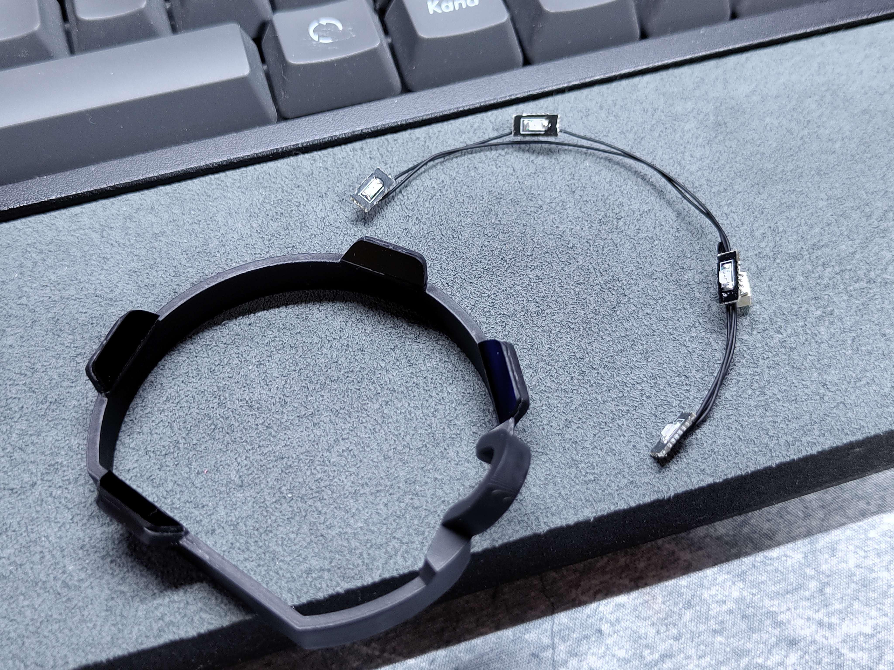
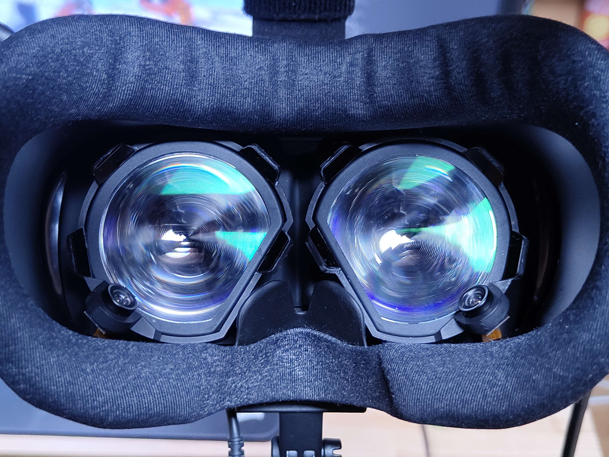
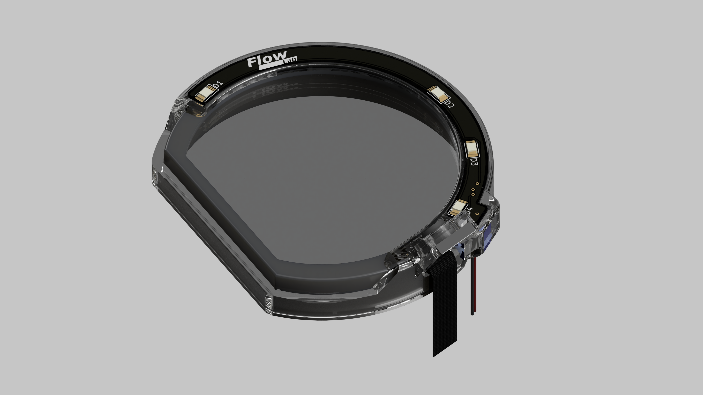
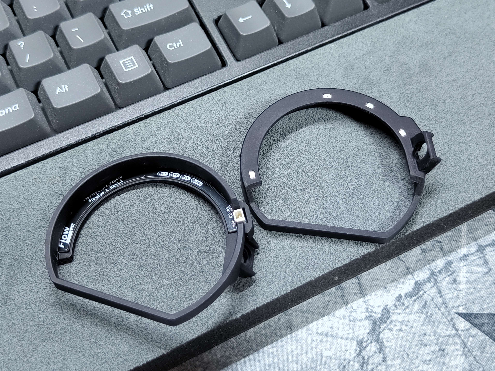
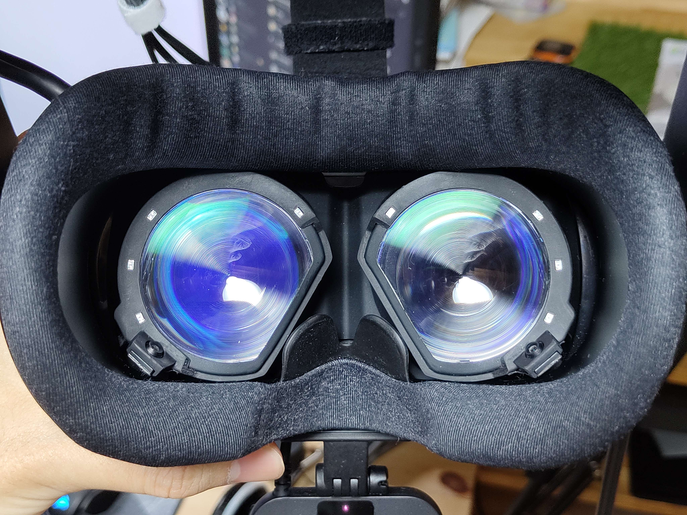

# flow-eye
IR Illuminator and Camera Mount for Valve Index DIY Eye Tracker

## Prototype

### Note
 - Designed for OV2640-160°.
 - A rubber ring is used to mount the camera.
 - The part in front of the LED is a visible light filter (acrylic that passes only infrared light). It is attached for appearance.

## Rev1.1

### Note
- Designed for OV2640-130°.
- Select a thickness of 0.8 mm when creating PCBs.
- [Schematic](https://github.com/ugokutennp/flow-eye/blob/main/Rev1.1/Pic/Schematic.png).
- [Other Notes (Japanese)](https://github.com/ugokutennp/flow-eye/blob/main/flow-eye.md).
