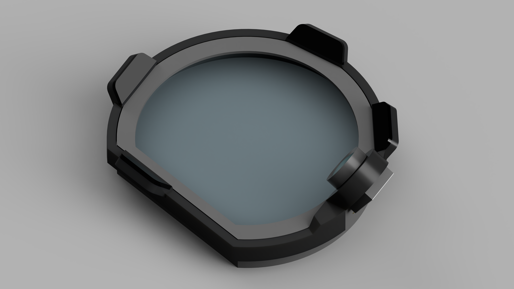

# flow-eye
## Prototype
IR Illuminator and Camera Mount for Valve Index DIY Eye Tracker

### Note
 - A rubber ring is used to mount the camera.
 - The part in front of the LED is a visible light filter (acrylic that passes only infrared light). It is attached for appearance.
## Rev1.1

WIP
